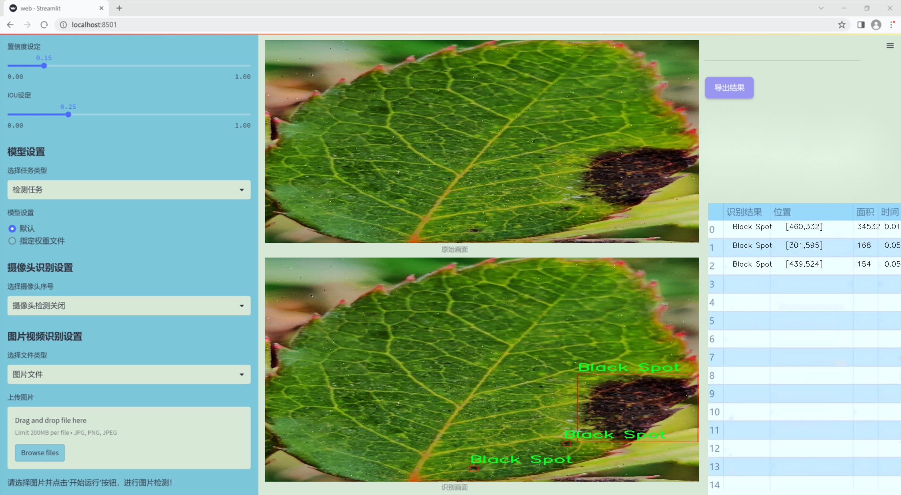
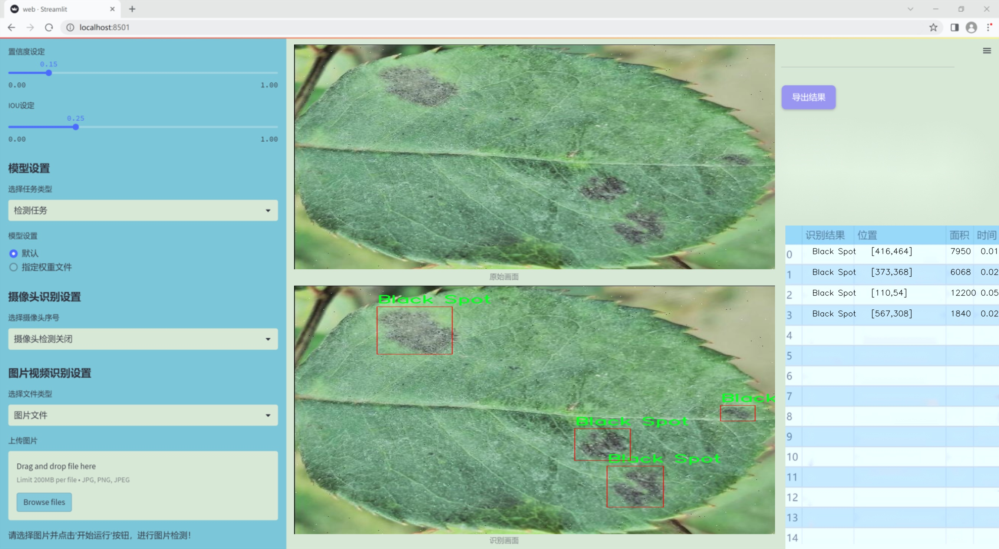
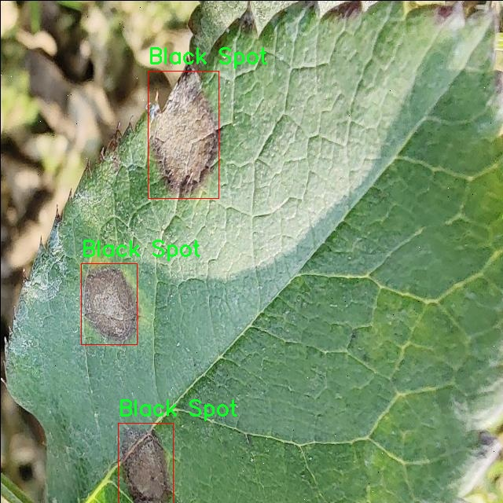
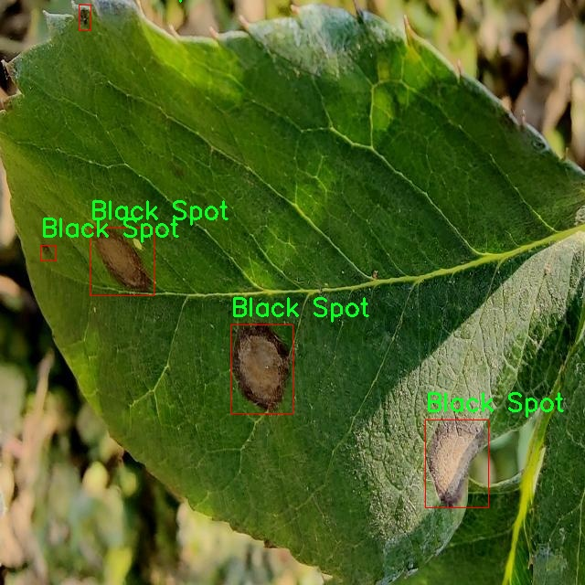
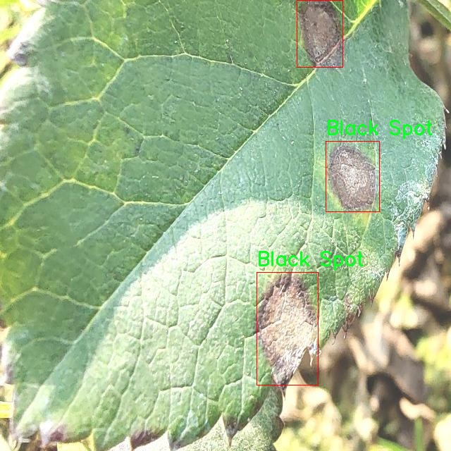
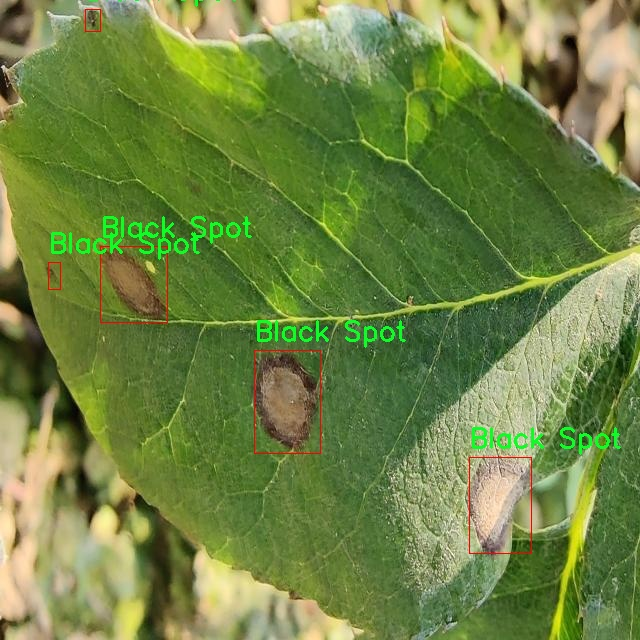
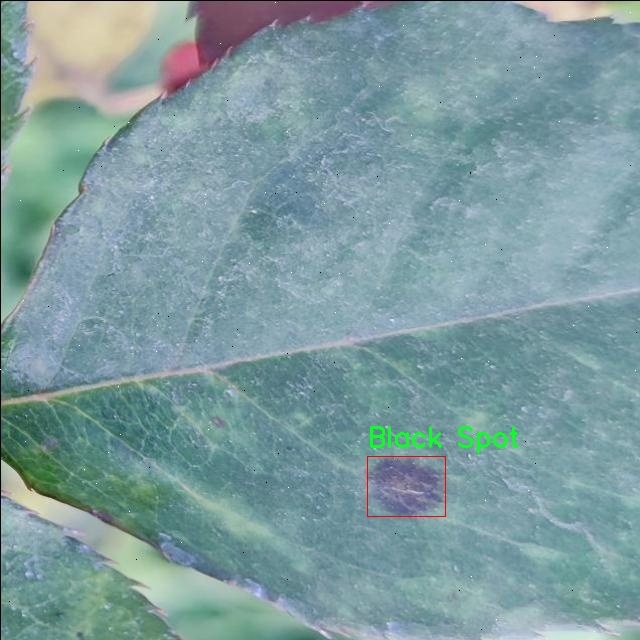

### 1.背景意义

研究背景与意义

随着全球气候变化和农业生产方式的转变，植物病害的发生频率和范围逐渐扩大，尤其是在经济作物中，玫瑰作为一种重要的观赏植物，其病害的检测与防治显得尤为重要。玫瑰叶片病害不仅影响植物的生长和美观，还可能导致经济损失。因此，开发一种高效、准确的病害检测系统，对保障玫瑰的健康生长和提高产量具有重要意义。

近年来，计算机视觉技术的迅猛发展为植物病害检测提供了新的解决方案。特别是基于深度学习的目标检测算法，如YOLO（You Only Look Once），因其高效性和实时性而被广泛应用于图像识别和分类任务。YOLOv11作为该系列的最新版本，结合了更先进的网络结构和优化算法，能够在复杂环境中实现更高的检测精度和速度。因此，基于改进YOLOv11的玫瑰叶片病害检测系统的研究，具有重要的理论和实践价值。

本研究所使用的数据集包含6037张经过精心标注的玫瑰叶片图像，涵盖了四种主要的病害类型：黑斑病、霜霉病、正常叶片和白粉病。这些数据的多样性和丰富性为模型的训练提供了坚实的基础。通过对数据集的预处理和增强，能够有效提高模型的泛化能力，进而提升病害检测的准确性。此外，随着数据集的不断扩展和改进，系统的性能也将得到持续优化。

综上所述，基于改进YOLOv11的玫瑰叶片病害检测系统的研究，不仅为植物病害的智能监测提供了新思路，也为相关领域的研究提供了数据支持和技术参考，具有广泛的应用前景和社会价值。

### 2.视频效果

[2.1 视频效果](https://www.bilibili.com/video/BV1qym8Y3Eao/)

### 3.图片效果






##### [项目涉及的源码数据来源链接](https://kdocs.cn/l/cszuIiCKVNis)**

注意：本项目提供训练的数据集和训练教程,由于版本持续更新,暂不提供权重文件（best.pt）,请按照6.训练教程进行训练后实现上图演示的效果。

### 4.数据集信息

##### 4.1 本项目数据集类别数＆类别名

nc: 4
names: ['Black Spot', 'Downy Mildew', 'Normal', 'Powdery Mildew']


该项目为【目标检测】数据集，请在【训练教程和Web端加载模型教程（第三步）】这一步的时候按照【目标检测】部分的教程来训练

##### 4.2 本项目数据集信息介绍

本项目数据集信息介绍

本项目旨在改进YOLOv11模型，以实现对玫瑰叶片病害的高效检测。为此，我们构建了一个专门针对“玫瑰叶片病害”的数据集，该数据集包含四个主要类别，分别是“黑斑病”、“霜霉病”、“正常叶片”和“白粉病”。这些类别不仅涵盖了常见的玫瑰叶片病害类型，还包括健康的叶片样本，以便于模型在训练过程中能够更好地区分病害与健康状态。

数据集的构建过程经过精心设计，确保了样本的多样性和代表性。每个类别的样本均来自不同的生长环境和气候条件，以模拟实际应用中可能遇到的各种情况。这种多样性有助于提高模型的泛化能力，使其在面对不同类型的玫瑰植物时仍能保持较高的检测准确率。

在数据集的标注过程中，我们采用了专业的植物病害识别标准，确保每个样本的标签准确无误。数据集中的图像涵盖了不同生长阶段的叶片，包括幼叶和成熟叶片，进一步增强了模型对不同生长状态的适应能力。此外，为了提高模型的鲁棒性，我们还对图像进行了多种数据增强处理，如旋转、缩放和亮度调整等，模拟不同的拍摄条件。

通过这一数据集的训练，我们期望能够显著提升YOLOv11在玫瑰叶片病害检测中的性能，使其能够快速、准确地识别出病害类型，从而为园艺工作者提供及时的病害预警和管理建议。最终目标是推动智能农业的发展，提高玫瑰种植的产量和质量，为农民和园艺爱好者提供更好的支持。











### 5.全套项目环境部署视频教程（零基础手把手教学）

[5.1 所需软件PyCharm和Anaconda安装教程（第一步）](https://www.bilibili.com/video/BV1BoC1YCEKi/?spm_id_from=333.999.0.0&vd_source=bc9aec86d164b67a7004b996143742dc)


[5.2 安装Python虚拟环境创建和依赖库安装视频教程（第二步）](https://www.bilibili.com/video/BV1ZoC1YCEBw?spm_id_from=333.788.videopod.sections&vd_source=bc9aec86d164b67a7004b996143742dc)

### 6.改进YOLOv11训练教程和Web_UI前端加载模型教程（零基础手把手教学）

[6.1 改进YOLOv11训练教程和Web_UI前端加载模型教程（第三步）](https://www.bilibili.com/video/BV1BoC1YCEhR?spm_id_from=333.788.videopod.sections&vd_source=bc9aec86d164b67a7004b996143742dc)


按照上面的训练视频教程链接加载项目提供的数据集，运行train.py即可开始训练



     Epoch   gpu_mem       box       obj       cls    labels  img_size
     1/200     20.8G   0.01576   0.01955  0.007536        22      1280: 100%|██████████| 849/849 [14:42<00:00,  1.04s/it]
               Class     Images     Labels          P          R     mAP@.5 mAP@.5:.95: 100%|██████████| 213/213 [01:14<00:00,  2.87it/s]
                 all       3395      17314      0.994      0.957      0.0957      0.0843

     Epoch   gpu_mem       box       obj       cls    labels  img_size
     2/200     20.8G   0.01578   0.01923  0.007006        22      1280: 100%|██████████| 849/849 [14:44<00:00,  1.04s/it]
               Class     Images     Labels          P          R     mAP@.5 mAP@.5:.95: 100%|██████████| 213/213 [01:12<00:00,  2.95it/s]
                 all       3395      17314      0.996      0.956      0.0957      0.0845

     Epoch   gpu_mem       box       obj       cls    labels  img_size
     3/200     20.8G   0.01561    0.0191  0.006895        27      1280: 100%|██████████| 849/849 [10:56<00:00,  1.29it/s]
               Class     Images     Labels          P          R     mAP@.5 mAP@.5:.95: 100%|███████   | 187/213 [00:52<00:00,  4.04it/s]
                 all       3395      17314      0.996      0.957      0.0957      0.0845


###### [项目数据集下载链接](https://kdocs.cn/l/cszuIiCKVNis)

### 7.原始YOLOv11算法讲解

YOLOv11是一种由Ultralytics公司开发的最新一代目标检测模型，以其增强的特征提取能力和更高的效率在计算机视觉领域引人注目。该模型在架构上进行了关键升级，通过更新主干和颈部结构，显著提高了对复杂视觉场景的理解和处理精度。YOLOv11不仅在目标检测上表现出色，还支持实例分割、图像分类、姿态估计和定向目标检测（OBB）等任务，展示出其多功能性。

与其前身YOLOv8相比，YOLOv11在设计上实现了深度和宽度的改变，同时引入了几个创新机制。其中，C3k2机制是对YOLOv8中的C2f的改进，提升了浅层特征的处理能力；C2PSA机制则进一步优化了特征图的处理流程。解耦头的创新设计，通过增加两个深度卷积（DWConv），提高了模型对细节的感知能力和分类准确性。

在性能上，YOLOv11m模型在COCO数据集上的平均精度（mAP）提高，并减少了22%的参数量，确保了在运算效率上的突破。该模型可以部署在多种平台上，包括边缘设备、云平台以及支持NVIDIA GPU的系统，彰显出卓越的灵活性和适应性。总体而言，YOLOv11通过一系列的创新突破，对目标检测领域产生了深远的影响，并为未来的开发提供了新的研究方向。


****文档**** ： _ _https://docs.ultralytics.com/models/yolo11/__

****代码链接**** ： _ _https://github.com/ultralytics/ultralytics__

******Performance Metrics******


​ ** **关键特性****

****◆**** ** **增强的特征提取能力**** ：YOLO11采用了改进的主干和颈部架构，增强了 ** **特征提取****
能力，能够实现更精确的目标检测和复杂任务的执行。

****◆**** ** **优化的效率和速度****
：YOLO11引入了精细化的架构设计和优化的训练流程，提供更快的处理速度，并在准确性和性能之间保持最佳平衡。

****◆**** ** **参数更少、精度更高****
：通过模型设计的改进，YOLO11m在COCO数据集上实现了更高的平均精度（mAP），同时使用的参数比YOLOv8m少22%，使其在计算上更加高效，而不牺牲准确性。

****◆**** ** **跨环境的适应性**** ：YOLO11可以无缝部署在各种环境中，包括边缘设备、云平台和支持NVIDIA
GPU的系统，确保最大的灵活性。

****◆**** ** **支持广泛任务****
：无论是目标检测、实例分割、图像分类、姿态估计还是定向目标检测（OBB），YOLO11都旨在应对一系列计算机视觉挑战。

****支持的任务和模式****


​YOLO11建立在YOLOv8中引入的多功能模型范围之上，为各种计算机视觉任务提供增强的支持:


​该表提供了YOLO11模型变体的概述，展示了它们在特定任务中的适用性以及与Inference、Validation、Training和Export等操作模式的兼容性。从实时检测到复杂的分割任务
，这种灵活性使YOLO11适用于计算机视觉的广泛应用。

##### yolov11的创新

■ yolov8 VS yolov11

YOLOv5，YOLOv8和YOLOv11均是ultralytics公司的作品，ultralytics出品必属精品。


​ **具体创新点** ：

**① 深度（depth）和宽度 （width）**

YOLOv8和YOLOv11是基本上完全不同。

**② C3k2机制**

C3k2有参数为c3k，其中在网络的浅层c3k设置为False。C3k2就相当于YOLOv8中的C2f。


​ **③ C2PSA机制**

下图为C2PSA机制的原理图。


​ **④ 解耦头**

解耦头中的分类检测头增加了两个 **DWConv** 。


▲Conv

    
    
    def autopad(k, p=None, d=1):  # kernel, padding, dilation
    
        """Pad to 'same' shape outputs."""
    
        if d > 1:
    
            k = d * (k - 1) + 1 if isinstance(k, int) else [d * (x - 1) + 1 for x in k]  # actual kernel-size
    
        if p is None:
    
            p = k // 2 if isinstance(k, int) else [x // 2 for x in k]  # auto-pad
    
    return p
    
    
    class Conv(nn.Module):
    
        """Standard convolution with args(ch_in, ch_out, kernel, stride, padding, groups, dilation, activation)."""
    
    
        default_act = nn.SiLU()  # default activation
    
    
        def __init__(self, c1, c2, k=1, s=1, p=None, g=1, d=1, act=True):
    
            """Initialize Conv layer with given arguments including activation."""
    
            super().__init__()
    
            self.conv = nn.Conv2d(c1, c2, k, s, autopad(k, p, d), groups=g, dilation=d, bias=False)
    
            self.bn = nn.BatchNorm2d(c2)
    
            self.act = self.default_act if act is True else act if isinstance(act, nn.Module) else nn.Identity()
    
    
        def forward(self, x):
    
            """Apply convolution, batch normalization and activation to input tensor."""
    
            return self.act(self.bn(self.conv(x)))
    
    
        def forward_fuse(self, x):
    
            """Perform transposed convolution of 2D data."""
    
            return self.act(self.conv(x))

▲Conv2d

    
    
    torch.nn.Conv2d(in_channels, out_channels, kernel_size, stride=1, padding=0, dilation=1, groups=1, bias=True, padding_mode='zeros')

▲DWConv

DWConv ** **代表 Depthwise Convolution（深度卷积）****
，是一种在卷积神经网络中常用的高效卷积操作。它主要用于减少计算复杂度和参数量。

    
    
    class DWConv(Conv):
    
        """Depth-wise convolution."""
    
    
        def __init__(self, c1, c2, k=1, s=1, d=1, act=True):  # ch_in, ch_out, kernel, stride, dilation, activation
    
            """Initialize Depth-wise convolution with given parameters."""
    
            super().__init__(c1, c2, k, s, g=math.gcd(c1, c2), d=d, act=act)


### 8.200+种全套改进YOLOV11创新点原理讲解

#### 8.1 200+种全套改进YOLOV11创新点原理讲解大全

由于篇幅限制，每个创新点的具体原理讲解就不全部展开，具体见下列网址中的改进模块对应项目的技术原理博客网址【Blog】（创新点均为模块化搭建，原理适配YOLOv5~YOLOv11等各种版本）

[改进模块技术原理博客【Blog】网址链接](https://gitee.com/qunmasj/good)


#### 8.2 精选部分改进YOLOV11创新点原理讲解

###### 这里节选部分改进创新点展开原理讲解(完整的改进原理见上图和[改进模块技术原理博客链接](https://gitee.com/qunmasj/good)【如果此小节的图加载失败可以通过CSDN或者Github搜索该博客的标题访问原始博客，原始博客图片显示正常】



### 视觉transformer(ViT)简介
视觉transformer(ViT)最近在各种计算机视觉任务中证明了巨大的成功，并受到了相当多的关注。与卷积神经网络(CNNs)相比，ViT具有更强的全局信息捕获能力和远程交互能力，表现出优于CNNs的准确性，特别是在扩大训练数据大小和模型大小时[An image is worth 16x16 words: Transformers for image recognition at scale,Coatnet]。

尽管ViT在低分辨率和高计算领域取得了巨大成功，但在高分辨率和低计算场景下，ViT仍不如cnn。例如，下图(左)比较了COCO数据集上当前基于cnn和基于vit的一级检测器。基于vit的检测器(160G mac)和基于cnn的检测器(6G mac)之间的效率差距超过一个数量级。这阻碍了在边缘设备的实时高分辨率视觉应用程序上部署ViT。


左图:现有的基于vit的一级检测器在实时目标检测方面仍然不如当前基于cnn的一级检测器，需要的计算量多出一个数量级。本文引入了第一个基于vit的实时对象检测器来弥补这一差距。在COCO上，efficientvit的AP比efficientdet高3.8，而mac较低。与YoloX相比，efficient ViT节省67.2%的计算成本，同时提供更高的AP。

中:随着输入分辨率的增加，计算成本呈二次增长，无法有效处理高分辨率的视觉应用。

右图:高分辨率对图像分割很重要。当输入分辨率从1024x2048降低到512x1024时，MobileNetV2的mIoU减少12% (8.5 mIoU)。在不提高分辨率的情况下，只提高模型尺寸是无法缩小性能差距的。

ViT的根本计算瓶颈是softmax注意模块，其计算成本随输入分辨率的增加呈二次增长。例如，如上图(中)所示，随着输入分辨率的增加，vit- small[Pytorch image models. https://github.com/rwightman/ pytorch-image-models]的计算成本迅速显著大于ResNet-152的计算成本。

解决这个问题的一个直接方法是降低输入分辨率。然而，高分辨率的视觉识别在许多现实世界的计算机视觉应用中是必不可少的，如自动驾驶，医疗图像处理等。当输入分辨率降低时，图像中的小物体和精细细节会消失，导致目标检测和语义分割性能显著下降。

上图(右)显示了在cityscape数据集上不同输入分辨率和宽度乘法器下MobileNetV2的性能。例如，将输入分辨率从1024x2048降低到512x1024会使cityscape的性能降低12% (8.5 mIoU)。即使是3.6倍高的mac，只放大模型尺寸而不增加分辨率也无法弥补这一性能损失。

除了降低分辨率外，另一种代表性的方法是限制softmax注意，方法是将其范围限制在固定大小的局部窗口内[Swin transformer,Swin transformer v2]或降低键/值张量的维数[Pyramid vision transformer,Segformer]。然而，它损害了ViT的非局部注意能力，降低了全局接受域(ViT最重要的优点)，使得ViT与大内核cnn的区别更小[A convnet for the 2020s,Scaling up your kernels to 31x31: Revisiting large kernel design in cnns,Lite pose: Efficient architecture design for 2d human pose estimation]。

本文介绍了一个有效的ViT体系结构，以解决这些挑战。发现没有必要坚持softmax注意力。本文建议用线性注意[Transformers are rnns: Fast autoregressive transformers with linear attention]代替softmax注意。

线性注意的关键好处是，它保持了完整的n 2 n^2n 2
 注意映射，就像softmax注意。同时，它利用矩阵乘法的联想特性，避免显式计算完整的注意映射，同时保持相同的功能。因此，它保持了softmax注意力的全局特征提取能力，且计算复杂度仅为线性。线性注意的另一个关键优点是它避免了softmax，这使得它在移动设备上更有效(下图左)。


左图:线性注意比类似mac下的softmax注意快3.3-4.5倍，这是因为去掉了硬件效率不高的softmax功能。延迟是在Qualcomm Snapdragon 855 CPU和TensorFlow-Lite上测量的。本文增加线性注意的头部数量，以确保它具有与softmax注意相似的mac。

中:然而，如果没有softmax注意中使用的非线性注意评分归一化，线性注意无法有效集中其注意分布，削弱了其局部特征提取能力。后文提供了可视化。

右图:本文用深度卷积增强线性注意，以解决线性注意的局限性。深度卷积可以有效地捕捉局部特征，而线性注意可以专注于捕捉全局信息。增强的线性注意在保持线性注意的效率和简单性的同时，表现出在各种视觉任务上的强大表现(图4)。

然而，直接应用线性注意也有缺点。以往的研究表明线性注意和softmax注意之间存在显著的性能差距(下图中间)。


左:高通骁龙855上的精度和延迟权衡。效率vit比效率网快3倍，精度更高。中:ImageNet上softmax注意与线性注意的比较。在相同的计算条件下，本文观察到softmax注意与线性注意之间存在显著的精度差距。而深度卷积增强模型后，线性注意的精度有明显提高。

相比之下，softmax注意的精度变化不大。在相同MAC约束下，增强线性注意比增强软最大注意提高了0.3%的精度。右图:与增强的softmax注意相比，增强的线性注意硬件效率更高，随着分辨率的增加，延迟增长更慢。

深入研究线性注意和softmax注意的详细公式，一个关键的区别是线性注意缺乏非线性注意评分归一化方案。这使得线性注意无法有效地将注意力分布集中在局部模式产生的高注意分数上，从而削弱了其局部特征提取能力。

本文认为这是线性注意的主要限制，使其性能不如softmax注意。本文提出了一个简单而有效的解决方案来解决这一限制，同时保持线性注意在低复杂度和低硬件延迟方面的优势。具体来说，本文建议通过在每个FFN层中插入额外的深度卷积来增强线性注意。因此，本文不需要依赖线性注意进行局部特征提取，避免了线性注意在捕捉局部特征方面的不足，并利用了线性注意在捕捉全局特征方面的优势。

本文广泛评估了efficient vit在低计算预算下对各种视觉任务的有效性，包括COCO对象检测、城市景观语义分割和ImageNet分类。本文想要突出高效的主干设计，所以没有包括任何正交的附加技术(例如，知识蒸馏，神经架构搜索)。尽管如此，在COCO val2017上，efficientvit的AP比efficientdet - d1高2.4倍，同时节省27.9%的计算成本。在cityscape上，efficientvit提供了比SegFormer高2.5个mIoU，同时降低了69.6%的计算成本。在ImageNet上，efficientvit在584M mac上实现了79.7%的top1精度，优于efficientnet - b1的精度，同时节省了16.6%的计算成本。

与现有的以减少参数大小或mac为目标的移动ViT模型[Mobile-former,Mobilevit,NASVit]不同，本文的目标是减少移动设备上的延迟。本文的模型不涉及复杂的依赖或硬件低效操作。因此，本文减少的计算成本可以很容易地转化为移动设备上的延迟减少。

在高通骁龙855 CPU上，efficient vit运行速度比efficientnet快3倍，同时提供更高的ImageNet精度。本文的代码和预训练的模型将在出版后向公众发布。

### Efficient Vision Transformer.
提高ViT的效率对于在资源受限的边缘平台上部署ViT至关重要，如手机、物联网设备等。尽管ViT在高计算区域提供了令人印象深刻的性能，但在针对低计算区域时，它通常不如以前高效的cnn[Efficientnet, mobilenetv3,Once for all: Train one network and specialize it for efficient deployment]。为了缩小差距，MobileViT建议结合CNN和ViT的长处，使用transformer将卷积中的局部处理替换为全局处理。MobileFormer提出了在MobileNet和Transformer之间建立双向桥以实现特征融合的并行化。NASViT提出利用神经架构搜索来搜索高效的ViT架构。

这些模型在ImageNet上提供了极具竞争力的准确性和效率的权衡。然而，它们并不适合高分辨率的视觉任务，因为它们仍然依赖于softmax注意力。


在本节中，本文首先回顾了自然语言处理中的线性注意，并讨论了它的优缺点。接下来，本文介绍了一个简单而有效的解决方案来克服线性注意的局限性。最后，给出了efficient vit的详细架构。

 为可学习投影矩阵。Oi表示矩阵O的第i行。Sim(·，·)为相似度函数。

虽然softmax注意力在视觉和NLP方面非常成功，但它并不是唯一的选择。例如，线性注意提出了如下相似度函数:


其中，φ(·)为核函数。在本工作中，本文选择了ReLU作为内核函数，因为它对硬件来说是友好的。当Sim(Q, K) = φ(Q)φ(K)T时，式(1)可改写为:


线性注意的一个关键优点是，它允许利用矩阵乘法的结合律，在不改变功能的情况下，将计算复杂度从二次型降低到线性型:


除了线性复杂度之外，线性注意的另一个关键优点是它不涉及注意模块中的softmax。Softmax在硬件上效率非常低。避免它可以显著减少延迟。例如，下图(左)显示了softmax注意和线性注意之间的延迟比较。在类似的mac上，线性注意力比移动设备上的softmax注意力要快得多。


#### EfficientViT
Enhancing Linear Attention with Depthwise Convolution

虽然线性注意在计算复杂度和硬件延迟方面优于softmax注意，但线性注意也有局限性。以往的研究[\[Luna: Linear unified nested attention,Random feature attention,Combiner: Full attention transformer with sparse computation cost,cosformer: Rethinking softmax in attention\]](https://afdian.net/item/602b9612927111ee9ec55254001e7c00)表明，在NLP中线性注意和softmax注意之间通常存在显著的性能差距。对于视觉任务，之前的研究[Visual correspondence hallucination,Quadtree attention for vision transformers]也表明线性注意不如softmax注意。在本文的实验中，本文也有类似的观察结果(图中)。


本文对这一假设提出了质疑，认为线性注意的低劣性能主要是由于局部特征提取能力的丧失。如果没有在softmax注意中使用的非线性评分归一化，线性注意很难像softmax注意那样集中其注意分布。下图(中间)提供了这种差异的示例。


在相同的原始注意力得分下，使用softmax比不使用softmax更能集中注意力。因此，线性注意不能有效地聚焦于局部模式产生的高注意分数(下图)，削弱了其局部特征提取能力。


注意图的可视化显示了线性注意的局限性。通过非线性注意归一化，softmax注意可以产生清晰的注意分布，如中间行所示。相比之下，线性注意的分布相对平滑，使得线性注意在捕捉局部细节方面的能力较弱，造成了显著的精度损失。本文通过深度卷积增强线性注意来解决这一限制，并有效提高了准确性。

介绍了一个简单而有效的解决方案来解决这个限制。本文的想法是用卷积增强线性注意，这在局部特征提取中是非常有效的。这样，本文就不需要依赖于线性注意来捕捉局部特征，而可以专注于全局特征提取。具体来说，为了保持线性注意的效率和简单性，本文建议在每个FFN层中插入一个深度卷积，这样计算开销很小，同时极大地提高了线性注意的局部特征提取能力。

#### Building Block

下图(右)展示了增强线性注意的详细架构，它包括一个线性注意层和一个FFN层，在FFN的中间插入深度卷积。


与之前的方法[Swin transformer,Coatnet]不同，本文在efficientvit中没有使用相对位置偏差。相对位置偏差虽然可以改善模型的性能，但它使模型容易受到分辨率变化[Segformer]的影响。多分辨率训练或新分辨率下的测试在检测和分割中很常见。去除相对位置偏差使高效率vit对输入分辨率更加灵活。

与之前低计算CNNs[Mobilenetv2,mobilenetv3]的设计不同，本文为下采样块添加了额外的下采样快捷方式。每个下采样快捷方式由一个平均池和一个1x1卷积组成。在本文的实验中，这些额外的下采样快捷方式可以稳定训练效率，提高性能。

#### Macro Architecture

下图说明了efficientvit的宏观体系结构。它由输入 stem 和4级组成。最近的研究[Coatnet,Levit,Early convolutions help transformers see better]表明在早期阶段使用卷积对ViT更好。本文遵循这个设计，在第三阶段开始使用增强的线性注意。


EfficientViT宏观架构。本文从第三阶段开始使用增强的线性注意。P2、P3和P4形成了一个金字塔特征图，用于检测和分割。P4用于分类。

为了突出高效的主干本身，本文对MBConv和FFN使用相同的扩展比e (e = 4)保持超参数简单，对所有深度卷积使用相同的内核大小k(除了输入stem)，对所有层使用相同的激活函数(hard swish)。

P2、P3和P4表示阶段2、3和4的输出，形成了特征图的金字塔。本文按照惯例将P2、P3和P4送至检测头。本文使用Yolov8进行检测。为了分割，本文融合了P2和P4。融合特征被馈送到一个轻量级头，包括几个卷积层，遵循Fast-SCNN。为了分类，本文将P4输入到轻量级头部，与MobileNetV3相同。


### 9.系统功能展示

图9.1.系统支持检测结果表格显示

  图9.2.系统支持置信度和IOU阈值手动调节

  图9.3.系统支持自定义加载权重文件best.pt(需要你通过步骤5中训练获得)

  图9.4.系统支持摄像头实时识别

  图9.5.系统支持图片识别

  图9.6.系统支持视频识别

  图9.7.系统支持识别结果文件自动保存

  图9.8.系统支持Excel导出检测结果数据


### 10. YOLOv11核心改进源码讲解

#### 10.1 RFAConv.py

以下是对代码中最核心部分的提取和详细中文注释：

```python
import torch
import torch.nn as nn
from einops import rearrange

# 定义高斯激活函数
class h_sigmoid(nn.Module):
    def __init__(self, inplace=True):
        super(h_sigmoid, self).__init__()
        self.relu = nn.ReLU6(inplace=inplace)  # 使用ReLU6作为基础激活函数

    def forward(self, x):
        return self.relu(x + 3) / 6  # 实现h-sigmoid函数

# 定义高斯Swish激活函数
class h_swish(nn.Module):
    def __init__(self, inplace=True):
        super(h_swish, self).__init__()
        self.sigmoid = h_sigmoid(inplace=inplace)  # 使用h_sigmoid作为基础

    def forward(self, x):
        return x * self.sigmoid(x)  # 实现h-swish函数

# 定义RFAConv模块
class RFAConv(nn.Module):
    def __init__(self, in_channel, out_channel, kernel_size, stride=1):
        super().__init__()
        self.kernel_size = kernel_size

        # 权重生成模块
        self.get_weight = nn.Sequential(
            nn.AvgPool2d(kernel_size=kernel_size, padding=kernel_size // 2, stride=stride),
            nn.Conv2d(in_channel, in_channel * (kernel_size ** 2), kernel_size=1, groups=in_channel, bias=False)
        )
        
        # 特征生成模块
        self.generate_feature = nn.Sequential(
            nn.Conv2d(in_channel, in_channel * (kernel_size ** 2), kernel_size=kernel_size, padding=kernel_size // 2, stride=stride, groups=in_channel, bias=False),
            nn.BatchNorm2d(in_channel * (kernel_size ** 2)),
            nn.ReLU()
        )
        
        # 最终卷积层
        self.conv = nn.Conv2d(in_channel, out_channel, kernel_size=kernel_size, stride=kernel_size)

    def forward(self, x):
        b, c = x.shape[0:2]  # 获取批量大小和通道数
        weight = self.get_weight(x)  # 生成权重
        h, w = weight.shape[2:]  # 获取特征图的高和宽
        
        # 计算权重的softmax
        weighted = weight.view(b, c, self.kernel_size ** 2, h, w).softmax(2)
        feature = self.generate_feature(x).view(b, c, self.kernel_size ** 2, h, w)  # 生成特征
        
        # 加权特征
        weighted_data = feature * weighted
        conv_data = rearrange(weighted_data, 'b c (n1 n2) h w -> b c (h n1) (w n2)', n1=self.kernel_size, n2=self.kernel_size)
        
        return self.conv(conv_data)  # 返回卷积结果

# 定义SE模块（Squeeze-and-Excitation）
class SE(nn.Module):
    def __init__(self, in_channel, ratio=16):
        super(SE, self).__init__()
        self.gap = nn.AdaptiveAvgPool2d((1, 1))  # 全局平均池化
        self.fc = nn.Sequential(
            nn.Linear(in_channel, ratio, bias=False),  # 压缩通道
            nn.ReLU(),
            nn.Linear(ratio, in_channel, bias=False),  # 恢复通道
            nn.Sigmoid()  # 激活
        )

    def forward(self, x):
        b, c = x.shape[0:2]  # 获取批量大小和通道数
        y = self.gap(x).view(b, c)  # 全局平均池化
        y = self.fc(y).view(b, c, 1, 1)  # 通过全连接层
        return y  # 返回通道注意力

# 定义RFCBAMConv模块
class RFCBAMConv(nn.Module):
    def __init__(self, in_channel, out_channel, kernel_size=3, stride=1):
        super().__init__()
        self.kernel_size = kernel_size
        self.generate = nn.Sequential(
            nn.Conv2d(in_channel, in_channel * (kernel_size ** 2), kernel_size, padding=kernel_size // 2, stride=stride, groups=in_channel, bias=False),
            nn.BatchNorm2d(in_channel * (kernel_size ** 2)),
            nn.ReLU()
        )
        self.get_weight = nn.Sequential(nn.Conv2d(2, 1, kernel_size=3, padding=1, bias=False), nn.Sigmoid())
        self.se = SE(in_channel)  # 引入SE模块

        self.conv = nn.Conv2d(in_channel, out_channel, kernel_size=kernel_size, stride=kernel_size)

    def forward(self, x):
        b, c = x.shape[0:2]  # 获取批量大小和通道数
        channel_attention = self.se(x)  # 计算通道注意力
        generate_feature = self.generate(x)  # 生成特征

        h, w = generate_feature.shape[2:]  # 获取特征图的高和宽
        generate_feature = generate_feature.view(b, c, self.kernel_size ** 2, h, w)
        
        # 重排特征图
        generate_feature = rearrange(generate_feature, 'b c (n1 n2) h w -> b c (h n1) (w n2)', n1=self.kernel_size, n2=self.kernel_size)
        
        # 计算加权特征
        unfold_feature = generate_feature * channel_attention
        max_feature, _ = torch.max(generate_feature, dim=1, keepdim=True)
        mean_feature = torch.mean(generate_feature, dim=1, keepdim=True)
        
        # 计算接收场注意力
        receptive_field_attention = self.get_weight(torch.cat((max_feature, mean_feature), dim=1))
        conv_data = unfold_feature * receptive_field_attention
        
        return self.conv(conv_data)  # 返回卷积结果
```

### 代码核心部分分析
1. **激活函数**：`h_sigmoid` 和 `h_swish` 是自定义的激活函数，主要用于提高模型的非线性表达能力。
2. **RFAConv**：该模块通过生成特征和权重来实现加权卷积，能够自适应地调整特征图的权重。
3. **SE模块**：Squeeze-and-Excitation模块用于增强通道间的关系，通过全局平均池化和全连接层实现通道注意力机制。
4. **RFCBAMConv**：结合了RFAConv和SE模块，进一步提升了特征提取的能力，能够自适应地关注不同的特征区域。

以上是对代码的核心部分及其功能的详细注释和分析。

该文件 `RFAConv.py` 实现了一些卷积神经网络模块，主要包括 `RFAConv`、`RFCBAMConv` 和 `RFCAConv` 三个类，以及一些辅助的激活函数和注意力机制。这些模块利用了深度学习库 PyTorch 进行构建，主要用于图像处理任务。

首先，文件中定义了两个自定义的激活函数类 `h_sigmoid` 和 `h_swish`。`h_sigmoid` 是一种变体的 sigmoid 函数，通过 ReLU6 函数进行实现。`h_swish` 则是通过将输入乘以 `h_sigmoid` 的输出实现的，常用于深度学习模型中以增强非线性特性。

接下来是 `RFAConv` 类的定义。该类实现了一种新的卷积操作，使用了一个自适应的权重生成机制。构造函数中定义了几个子模块，包括一个用于生成权重的平均池化和卷积组合，以及一个用于生成特征的卷积、批归一化和 ReLU 激活的组合。在前向传播中，输入经过权重生成模块得到权重后，通过 softmax 归一化处理，然后与生成的特征相乘，最后经过重排后输入到最终的卷积层中。

`SE` 类实现了 Squeeze-and-Excitation (SE) 模块，这是一种用于增强特征表示的注意力机制。它通过全局平均池化来获取通道的全局信息，并通过两个全连接层进行特征重标定，输出的结果用于调整输入特征的通道权重。

`RFCBAMConv` 类结合了通道注意力和空间注意力。它首先生成特征，然后通过 SE 模块计算通道注意力。接着，生成的特征经过重排后与通道注意力相乘，并计算最大值和均值特征以生成空间注意力。最终，经过加权后的特征输入到卷积层中进行处理。

最后，`RFCAConv` 类实现了一种结合了通道和空间注意力的卷积操作。它首先生成特征并进行重排，然后通过自适应池化分别获取高度和宽度的信息。接着，这些信息通过一个小的卷积网络生成通道注意力，最后将生成的特征与通道和空间注意力相乘，输出到最终的卷积层。

整体来看，这个文件实现了多种卷积模块，结合了自适应权重生成和注意力机制，旨在提升卷积神经网络在图像处理任务中的表现。

#### 10.2 test_selective_scan.py

以下是代码中最核心的部分，并附上详细的中文注释：

```python
import torch
import torch.nn.functional as F

def build_selective_scan_fn(selective_scan_cuda: object = None, mode="mamba_ssm"):
    """
    构建选择性扫描函数的工厂函数，根据给定的CUDA实现和模式返回一个选择性扫描函数。
    """
    class SelectiveScanFn(torch.autograd.Function):
        @staticmethod
        def forward(ctx, u, delta, A, B, C, D=None, z=None, delta_bias=None, delta_softplus=False, return_last_state=False):
            """
            前向传播函数，计算选择性扫描的输出。
            参数:
                u: 输入张量
                delta: 变化率张量
                A, B, C: 权重张量
                D: 可选的偏置张量
                z: 可选的门控张量
                delta_bias: 可选的变化率偏置
                delta_softplus: 是否使用softplus激活
                return_last_state: 是否返回最后状态
            返回:
                输出张量或输出张量和最后状态的元组
            """
            # 确保输入张量是连续的
            if u.stride(-1) != 1:
                u = u.contiguous()
            if delta.stride(-1) != 1:
                delta = delta.contiguous()
            if D is not None:
                D = D.contiguous()
            if B.stride(-1) != 1:
                B = B.contiguous()
            if C.stride(-1) != 1:
                C = C.contiguous()
            if z is not None and z.stride(-1) != 1:
                z = z.contiguous()

            # 检查输入形状的有效性
            assert u.shape[1] % (B.shape[1]) == 0 

            # 调用CUDA实现的前向函数
            out, x, *rest = selective_scan_cuda.fwd(u, delta, A, B, C, D, z, delta_bias, delta_softplus)

            # 保存必要的上下文以便反向传播
            ctx.save_for_backward(u, delta, A, B, C, D, z, delta_bias, x)

            # 返回输出或输出和最后状态
            return out if not return_last_state else (out, x[:, :, -1])  # 返回最后状态

        @staticmethod
        def backward(ctx, dout):
            """
            反向传播函数，计算梯度。
            参数:
                dout: 输出的梯度
            返回:
                输入张量的梯度
            """
            # 从上下文中恢复保存的张量
            u, delta, A, B, C, D, z, delta_bias, x = ctx.saved_tensors

            # 调用CUDA实现的反向函数
            du, ddelta, dA, dB, dC, dD, ddelta_bias, *rest = selective_scan_cuda.bwd(u, delta, A, B, C, D, z, delta_bias, dout, x)

            return du, ddelta, dA, dB, dC, dD if D is not None else None, None, ddelta_bias if delta_bias is not None else None

    def selective_scan_fn(u, delta, A, B, C, D=None, z=None, delta_bias=None, delta_softplus=False, return_last_state=False):
        """
        选择性扫描函数的接口，调用选择性扫描的前向传播。
        """
        return SelectiveScanFn.apply(u, delta, A, B, C, D, z, delta_bias, delta_softplus, return_last_state)

    return selective_scan_fn

# 选择性扫描函数的使用示例
selective_scan_fn = build_selective_scan_fn(selective_scan_cuda=None, mode="mamba_ssm")
```

### 代码说明：
1. **导入必要的库**：引入`torch`和`torch.nn.functional`用于张量操作和激活函数。
2. **构建选择性扫描函数**：`build_selective_scan_fn`是一个工厂函数，用于创建选择性扫描的前向和反向传播逻辑。
3. **前向传播**：
   - `forward`方法接收多个输入张量，并确保它们是连续的。
   - 进行输入形状的有效性检查。
   - 调用CUDA实现的前向函数计算输出。
   - 保存必要的张量以便后续反向传播使用。
4. **反向传播**：
   - `backward`方法从上下文中恢复保存的张量，并调用CUDA实现的反向函数计算梯度。
5. **接口函数**：`selective_scan_fn`是对外提供的接口，简化了前向传播的调用。

以上代码是实现选择性扫描的核心部分，提供了前向和反向传播的基本逻辑。

这个程序文件 `test_selective_scan.py` 是一个用于测试选择性扫描（Selective Scan）操作的实现，主要依赖于 PyTorch 框架。文件中包含了多个函数和类的定义，主要功能是构建选择性扫描的前向和反向传播过程，并通过单元测试验证其正确性。

程序首先导入了必要的库，包括 `torch` 和 `pytest`。然后定义了一个 `build_selective_scan_fn` 函数，该函数用于构建选择性扫描的前向和反向传播的自定义操作。它接收一个 CUDA 后端实现和一些参数，返回一个选择性扫描函数。

在 `SelectiveScanFn` 类中，定义了静态方法 `forward` 和 `backward`。`forward` 方法负责计算前向传播，接收多个输入参数，包括输入张量 `u`、`delta`、`A`、`B`、`C` 等，并进行必要的张量格式转换和维度检查。根据不同的模式（如 `mamba_ssm`、`ssoflex` 等），调用相应的 CUDA 后端函数进行计算。最后，它将计算结果保存到上下文中，以便在反向传播时使用。

`backward` 方法则实现了反向传播的逻辑，计算梯度并返回。它会根据上下文中保存的张量和输入参数，调用相应的 CUDA 后端函数来计算梯度。

文件中还定义了 `selective_scan_ref` 和 `selective_scan_ref_v2` 函数，这两个函数实现了选择性扫描的参考版本，主要用于与 CUDA 实现的结果进行比较。它们接受与前向传播相同的参数，并执行选择性扫描的计算。

接下来，程序设置了不同的模式，并根据模式导入相应的 CUDA 后端实现。通过调用 `build_selective_scan_fn` 函数，构建出具体的选择性扫描函数和参考函数。

最后，使用 `pytest` 框架定义了一个测试函数 `test_selective_scan`，该函数通过参数化测试不同的输入组合，验证选择性扫描函数的输出与参考实现的一致性。测试中会生成随机输入数据，并比较前向传播和反向传播的结果，确保实现的正确性。

总的来说，这个程序文件实现了选择性扫描操作的自定义前向和反向传播逻辑，并通过单元测试验证了其正确性，适用于深度学习模型中的特定计算需求。

#### 10.3 CTrans.py

以下是代码中最核心的部分，并附上详细的中文注释：

```python
import torch
import torch.nn as nn
import numpy as np
from torch.nn import Dropout, Softmax, Conv2d, LayerNorm

class Channel_Embeddings(nn.Module):
    """从图像的补丁和位置嵌入构建通道嵌入。"""
    def __init__(self, patchsize, img_size, in_channels):
        super().__init__()
        img_size = (img_size, img_size)  # 将图像大小转换为元组
        patch_size = (patchsize, patchsize)  # 将补丁大小转换为元组
        n_patches = (img_size[0] // patch_size[0]) * (img_size[1] // patch_size[1])  # 计算补丁数量

        # 使用最大池化和卷积层来提取补丁嵌入
        self.patch_embeddings = nn.Sequential(
            nn.MaxPool2d(kernel_size=5, stride=5),
            Conv2d(in_channels=in_channels,
                    out_channels=in_channels,
                    kernel_size=patchsize // 5,
                    stride=patchsize // 5)
        )

        # 位置嵌入参数
        self.position_embeddings = nn.Parameter(torch.zeros(1, n_patches, in_channels))
        self.dropout = Dropout(0.1)  # Dropout层用于防止过拟合

    def forward(self, x):
        """前向传播函数，计算嵌入。"""
        if x is None:
            return None
        x = self.patch_embeddings(x)  # 提取补丁嵌入
        x = x.flatten(2)  # 将特征展平
        x = x.transpose(-1, -2)  # 转置以便于后续操作
        embeddings = x + self.position_embeddings  # 添加位置嵌入
        embeddings = self.dropout(embeddings)  # 应用Dropout
        return embeddings

class Attention_org(nn.Module):
    """实现多头注意力机制。"""
    def __init__(self, vis, channel_num):
        super(Attention_org, self).__init__()
        self.vis = vis  # 可视化标志
        self.KV_size = sum(channel_num)  # 键值对的总通道数
        self.channel_num = channel_num  # 通道数
        self.num_attention_heads = 4  # 注意力头的数量

        # 定义查询、键、值的线性变换
        self.query = nn.ModuleList([nn.Linear(c, c, bias=False) for c in channel_num])
        self.key = nn.Linear(self.KV_size, self.KV_size, bias=False)
        self.value = nn.Linear(self.KV_size, self.KV_size, bias=False)
        self.softmax = Softmax(dim=3)  # Softmax层用于计算注意力权重
        self.attn_dropout = Dropout(0.1)  # Dropout层用于注意力权重
        self.proj_dropout = Dropout(0.1)  # Dropout层用于输出

    def forward(self, *embeddings):
        """前向传播函数，计算注意力输出。"""
        multi_head_Q = [query(emb) for query, emb in zip(self.query, embeddings) if emb is not None]
        multi_head_K = self.key(torch.cat(embeddings, dim=2))  # 计算键
        multi_head_V = self.value(torch.cat(embeddings, dim=2))  # 计算值

        # 计算注意力分数
        attention_scores = [torch.matmul(Q, multi_head_K) / np.sqrt(self.KV_size) for Q in multi_head_Q]
        attention_probs = [self.softmax(score) for score in attention_scores]  # 计算注意力概率

        # 应用Dropout
        attention_probs = [self.attn_dropout(prob) for prob in attention_probs]

        # 计算上下文层
        context_layers = [torch.matmul(prob, multi_head_V) for prob in attention_probs]
        outputs = [query_layer + emb for query_layer, emb in zip(context_layers, embeddings) if emb is not None]  # 残差连接

        return outputs  # 返回每个通道的输出

class ChannelTransformer(nn.Module):
    """通道变换器模型。"""
    def __init__(self, channel_num=[64, 128, 256, 512], img_size=640, vis=False, patchSize=[40, 20, 10, 5]):
        super().__init__()
        self.embeddings = nn.ModuleList([Channel_Embeddings(patchSize[i], img_size // (2 ** (i + 2)), channel_num[i]) for i in range(len(channel_num))])
        self.encoder = Encoder(vis, channel_num)  # 编码器

    def forward(self, en):
        """前向传播函数，计算嵌入和编码。"""
        embeddings = [emb(en[i]) for i, emb in enumerate(self.embeddings) if en[i] is not None]
        encoded = self.encoder(*embeddings)  # 编码
        return [encoded[i] + en[i] for i in range(len(encoded)) if en[i] is not None]  # 残差连接

class GetIndexOutput(nn.Module):
    """获取特定索引的输出。"""
    def __init__(self, index):
        super().__init__()
        self.index = index  # 存储索引

    def forward(self, x):
        """前向传播函数，返回指定索引的输出。"""
        return x[self.index]
```

### 代码说明：
1. **Channel_Embeddings**: 该类用于将输入图像转换为补丁嵌入和位置嵌入，并应用Dropout以防止过拟合。
2. **Attention_org**: 实现了多头注意力机制，计算输入嵌入的注意力分数和上下文层，使用残差连接来增强模型的表现。
3. **ChannelTransformer**: 整个模型的核心部分，负责将输入图像通过嵌入层和编码器进行处理，并返回输出。
4. **GetIndexOutput**: 用于从模型输出中提取特定索引的结果，方便后续处理。

这些核心部分构成了通道变换器的基础，能够处理图像数据并提取有用的特征。

这个程序文件 `CTrans.py` 实现了一个名为 `ChannelTransformer` 的深度学习模型，主要用于图像处理任务。该模型的设计灵感来源于 Transformer 架构，结合了通道注意力机制和图像嵌入技术。下面是对代码的详细讲解。

首先，文件导入了一些必要的库，包括 PyTorch 和 NumPy。接着，定义了几个重要的类，分别负责不同的功能。

`Channel_Embeddings` 类用于构建图像的嵌入。它接收图像的大小和通道数，并通过卷积和池化操作将图像划分为多个补丁（patch），同时生成位置嵌入。位置嵌入用于保持图像中各个补丁的位置信息。前向传播时，该类将输入图像转换为补丁嵌入，并添加位置嵌入。

`Reconstruct` 类用于重建特征图。它通过卷积和上采样操作，将经过编码的特征图恢复到原始图像的大小。该类使用了批归一化和 ReLU 激活函数，以提高模型的表现。

`Attention_org` 类实现了多头注意力机制。它通过线性变换生成查询（Q）、键（K）和值（V），并计算注意力分数。注意力机制允许模型关注输入的不同部分，从而更好地捕捉特征。该类还包括对注意力权重的归一化和丢弃操作，以增强模型的泛化能力。

`Mlp` 类实现了一个简单的多层感知机（MLP），用于对特征进行进一步处理。它包含两个全连接层和一个激活函数（GELU），并使用 Xavier 初始化方法来初始化权重。

`Block_ViT` 类是模型的核心模块，结合了注意力机制和前馈网络。它通过层归一化处理输入特征，并将其传递给注意力层和 MLP 层。每个输入通道的特征都经过独立处理，最后将结果相加以实现残差连接。

`Encoder` 类由多个 `Block_ViT` 组成，负责对输入特征进行编码。它对每个输入通道的特征进行处理，并在最后应用层归一化。

`ChannelTransformer` 类是整个模型的主类，负责初始化各个组件。它接收图像的通道数、大小和补丁大小，并创建相应的嵌入层和编码器。前向传播时，该类将输入图像通过嵌入层和编码器处理，并通过重建层输出结果。

最后，`GetIndexOutput` 类用于从模型的输出中提取特定索引的结果，方便后续处理。

总体而言，这个程序实现了一个复杂的图像处理模型，结合了多种深度学习技术，旨在提高图像特征的提取和重建能力。通过使用通道注意力机制，模型能够更好地关注图像中的重要信息，从而提升性能。

#### 10.4 starnet.py

以下是经过简化和注释的核心代码部分，保留了实现 StarNet 的关键结构和功能。

```python
import torch
import torch.nn as nn
from timm.models.layers import DropPath, trunc_normal_

class ConvBN(torch.nn.Sequential):
    """
    定义一个卷积层，后接批归一化层（可选）。
    """
    def __init__(self, in_planes, out_planes, kernel_size=1, stride=1, padding=0, dilation=1, groups=1, with_bn=True):
        super().__init__()
        # 添加卷积层
        self.add_module('conv', torch.nn.Conv2d(in_planes, out_planes, kernel_size, stride, padding, dilation, groups))
        # 如果需要，添加批归一化层
        if with_bn:
            self.add_module('bn', torch.nn.BatchNorm2d(out_planes))
            # 初始化批归一化层的权重和偏置
            torch.nn.init.constant_(self.bn.weight, 1)
            torch.nn.init.constant_(self.bn.bias, 0)

class Block(nn.Module):
    """
    StarNet 的基本构建块，包含深度可分离卷积和元素级乘法。
    """
    def __init__(self, dim, mlp_ratio=3, drop_path=0.):
        super().__init__()
        # 深度可分离卷积
        self.dwconv = ConvBN(dim, dim, 7, 1, (7 - 1) // 2, groups=dim, with_bn=True)
        # 线性变换
        self.f1 = ConvBN(dim, mlp_ratio * dim, 1, with_bn=False)
        self.f2 = ConvBN(dim, mlp_ratio * dim, 1, with_bn=False)
        self.g = ConvBN(mlp_ratio * dim, dim, 1, with_bn=True)
        self.dwconv2 = ConvBN(dim, dim, 7, 1, (7 - 1) // 2, groups=dim, with_bn=False)
        self.act = nn.ReLU6()  # 激活函数
        self.drop_path = DropPath(drop_path) if drop_path > 0. else nn.Identity()  # 随机深度

    def forward(self, x):
        input = x  # 保存输入
        x = self.dwconv(x)  # 深度可分离卷积
        x1, x2 = self.f1(x), self.f2(x)  # 线性变换
        x = self.act(x1) * x2  # 元素级乘法
        x = self.dwconv2(self.g(x))  # 进一步卷积
        x = input + self.drop_path(x)  # 残差连接
        return x

class StarNet(nn.Module):
    """
    StarNet 网络结构，包含多个阶段，每个阶段由多个 Block 组成。
    """
    def __init__(self, base_dim=32, depths=[3, 3, 12, 5], mlp_ratio=4, drop_path_rate=0.0, num_classes=1000):
        super().__init__()
        self.num_classes = num_classes
        self.in_channel = 32
        # stem 层
        self.stem = nn.Sequential(ConvBN(3, self.in_channel, kernel_size=3, stride=2, padding=1), nn.ReLU6())
        dpr = [x.item() for x in torch.linspace(0, drop_path_rate, sum(depths))]  # 随机深度
        # 构建各个阶段
        self.stages = nn.ModuleList()
        cur = 0
        for i_layer in range(len(depths)):
            embed_dim = base_dim * 2 ** i_layer  # 当前阶段的嵌入维度
            down_sampler = ConvBN(self.in_channel, embed_dim, 3, 2, 1)  # 下采样层
            self.in_channel = embed_dim
            blocks = [Block(self.in_channel, mlp_ratio, dpr[cur + i]) for i in range(depths[i_layer])]  # 构建 Block
            cur += depths[i_layer]
            self.stages.append(nn.Sequential(down_sampler, *blocks))  # 添加到阶段中
        
    def forward(self, x):
        features = []  # 存储特征
        x = self.stem(x)  # 通过 stem 层
        features.append(x)
        for stage in self.stages:
            x = stage(x)  # 通过每个阶段
            features.append(x)
        return features  # 返回所有特征

# 定义不同规模的 StarNet 模型
def starnet_s1(pretrained=False, **kwargs):
    model = StarNet(24, [2, 2, 8, 3], **kwargs)
    return model

def starnet_s2(pretrained=False, **kwargs):
    model = StarNet(32, [1, 2, 6, 2], **kwargs)
    return model

def starnet_s3(pretrained=False, **kwargs):
    model = StarNet(32, [2, 2, 8, 4], **kwargs)
    return model

def starnet_s4(pretrained=False, **kwargs):
    model = StarNet(32, [3, 3, 12, 5], **kwargs)
    return model
```

### 代码说明：
1. **ConvBN 类**：定义了一个包含卷积层和可选的批归一化层的模块。
2. **Block 类**：实现了 StarNet 的基本构建块，包含深度可分离卷积、线性变换和元素级乘法，最后通过残差连接将输入与输出相加。
3. **StarNet 类**：构建整个网络结构，包含多个阶段，每个阶段由多个 Block 组成。stem 层用于处理输入图像。
4. **模型构造函数**：提供了不同规模的 StarNet 模型的构造函数。

这个程序文件实现了一个名为StarNet的深度学习网络，主要用于图像处理任务。文件开头的文档字符串简要说明了StarNet的设计理念，强调了其简化的结构，特别是元素级乘法的关键贡献。文件中定义了多个模型变体（如starnet_s050、starnet_s100等），并提供了相应的预训练模型下载链接。

在代码中，首先导入了必要的库，包括PyTorch和一些辅助模块。接着定义了一个ConvBN类，它是一个组合模块，包含卷积层和可选的批归一化层。该类的构造函数接受多个参数以配置卷积层的行为，并初始化批归一化的权重和偏置。

接下来定义了Block类，它是StarNet的基本构建块。Block类中包含深度卷积、两个线性变换和一个ReLU6激活函数。Block的前向传播方法实现了输入的处理流程，包括深度卷积、两个线性变换的输出相乘、以及通过残差连接和随机深度（DropPath）进行输出。

StarNet类是整个网络的核心实现，包含多个阶段（stages），每个阶段由下采样和多个Block组成。构造函数中，首先定义了一个stem层用于处理输入图像，然后根据给定的深度构建各个阶段的模块。每个阶段的输入通道数会随着网络的深入而增加。网络的权重初始化通过_apply_weights方法完成。

在StarNet类的前向传播方法中，输入图像经过stem层和各个阶段的处理，最终返回每个阶段的特征图。

最后，文件中定义了多个函数（如starnet_s1、starnet_s2等），用于创建不同配置的StarNet模型，并可选择加载预训练权重。这些函数为用户提供了灵活的模型选择，适应不同的应用需求。

整体来看，starnet.py文件实现了一个结构清晰、易于扩展的深度学习网络，突出了其在图像处理任务中的有效性和简洁性。

### 11.完整训练+Web前端界面+200+种全套创新点源码、数据集获取


# [下载链接：https://mbd.pub/o/bread/Z5Wbk5lq](https://mbd.pub/o/bread/Z5Wbk5lq)